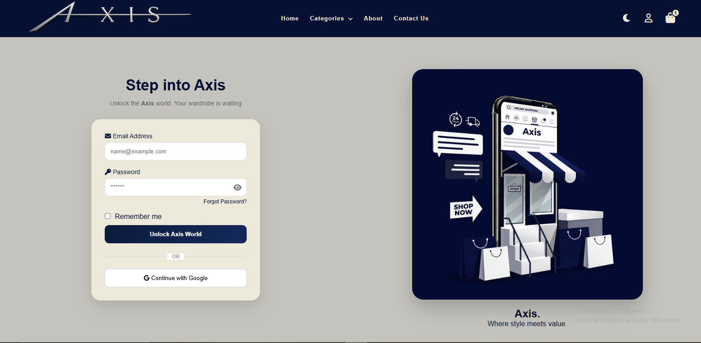
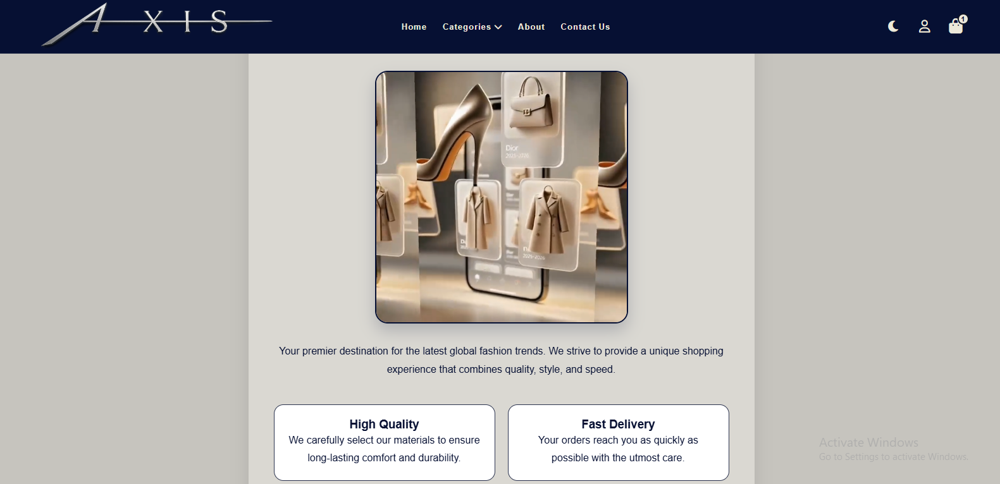

# Axis - Fashion E-Commerce Website

## Overview

Axis is a responsive front-end fashion e-commerce website developed as a collaborative university project by **Axis Team**. The website provides users with a modern and user-friendly shopping experience through an organized layout, responsive design, and interactive features.

The project was developed to apply front-end development concepts and build a complete multi-page fashion e-commerce website using HTML, CSS, and JavaScript.

---
## Preview

### Home Page

### Dark Mode

### Products

### Shopping Cart

### Sign In

### About

---

## Features

- Responsive design for different screen sizes
- Modern and clean user interface
- Dark Mode and Light Mode
- Product search
- Home page with featured products
- Product categories:
  - Men
  - Girls
  - Bags
  - Shoes
  - Accessories
  - Skin Care
- Shopping Cart page
- Sign In page
- About page
- Contact page
- Interactive user interface using JavaScript
- Easy navigation between pages

---

## Technologies Used

- HTML5
- CSS3
- JavaScript

---

## Project Purpose

This project was developed as part of our university coursework to strengthen our front-end development skills and gain practical experience in building a responsive fashion e-commerce website.

---

## My Contribution

As a member of **Axis Team**, I contributed to the front-end development of the project, including implementing user interface components, styling web pages, improving responsiveness, and collaborating with the team throughout the development process.

---

## Team Project

This project was developed collaboratively by **Axis Team** as part of a university coursework.

---

## Future Improvements

- User authentication
- Wishlist
- Checkout and payment system
- Database integration
- Backend development
- Order management

---

## Author

**Nermeen Elnabwy**

Computer Science Student FCAIH

Helwan University
